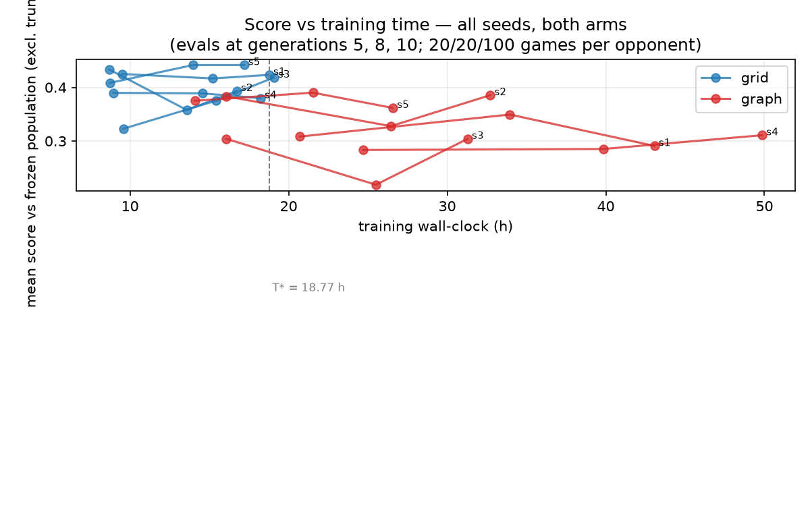
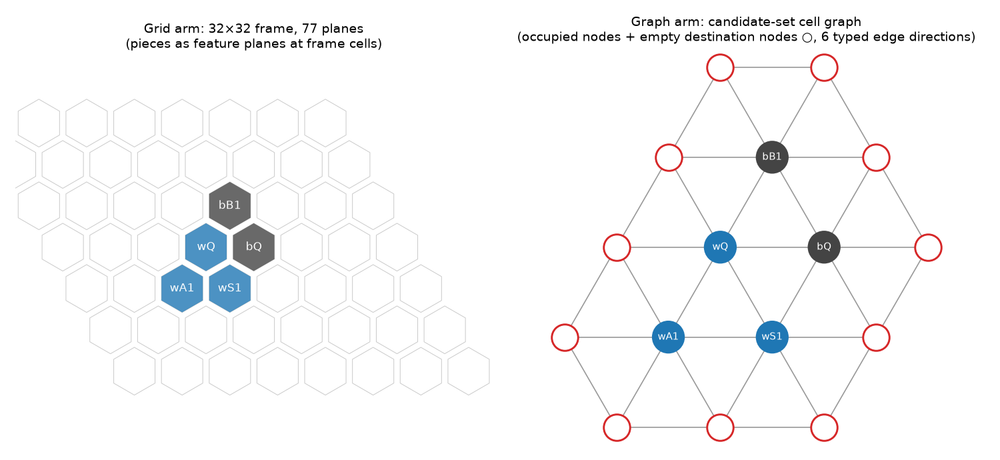
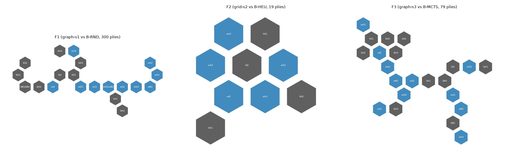

*Copie française (D-006) — version 1.0-draft 2026-10-09; les nombres et affirmations sont identiques au master anglais.*

# Pages liminaires (livret v1, 2026-10-09)

**Titre.** Représentations en grille et en graphe pour l'apprentissage
par auto-jeu à Hive : une comparaison pré-enregistrée sous budget de
calcul limité *(Grid vs. Graph Representations for Self-Play Learning
in Hive: a Pre-Registered Comparison under Limited Compute)*

*(Descriptif, sans résultat présumé, selon plan ch. 20.)*

**Auteur.** Mohamed Bechir Kefi

**Statut.** Rapport de recherche indépendant — non évalué par les
pairs, et qui n'est la publication d'aucune institution. Version
1.0-draft, 2026-10-09.

**Code et artefacts.** Dépôt `hive-graph-selfplay` (étiquette de
publication et accès à fixer au moment de la diffusion, G-PUBLIC) ;
manifeste des résultats sous `results/` ; chaque figure et chaque table
se régénèrent par scripts à partir des enregistrements bruts par
partie.

**Déclaration d'assistance par IA.** Cette étude a été exécutée selon
une méthodologie « l'humain comme chercheur principal » (human-as-PI)
dans laquelle un assistant de recherche IA (Claude, Anthropic) a
implémenté le code, mené les campagnes et rédigé le texte sous un
système de portes réservant toutes les décisions scientifiques — gels,
budgets, dépenses, publication — à l'auteur humain, qui assume chaque
affirmation. La division du travail complète est documentée dans le
dépôt (`docs/methodology.md`) et résumée dans les annexes.

**Résumé (164 mots dans la version anglaise).** Hive est un jeu de
stratégie hexagonal sans plateau dont les coups sont des paires (pièce,
destination) sur un ensemble de cellules en perpétuel changement — un
candidat naturel, en principe, pour des encodages par réseaux de
neurones en graphe plutôt que pour les encodages convolutifs en grille
standards des systèmes de type AlphaZero. Nous testons cette intuition
sous un protocole pré-enregistré, gelé avant toute exécution
comparative : un CNN en grille et un réseau relationnel à passage de
messages de capacité appariée (+2.1%) partagent un moteur validé côté
règles, un décodeur d'actions unique, des réglages d'entraînement
identiques, une population gelée de trois adversaires et 250 ouvertures
gelées, évalués sous deux lectures budgétaires (à exemples
d'entraînement égaux ; à temps mural égal à un seuil pré-enregistré),
avec cinq graines indépendantes par bras et la troncature rapportée
comme un résultat à part entière. L'hypothèse est rejetée : le bras
graphe obtient un score inférieur contre deux des trois adversaires
sous les deux lectures, à un coût en temps mural double, son déficit se
concentrant dans la conversion des positions gagnées. Les ablations
montrent que les relations d'arêtes typées du bras graphe sont
porteuses pour la stabilité de l'optimisation, tandis que son
agrégation globale (global pooling) est dispensable. Négatif,
pré-enregistré et entièrement reproductible à partir des
enregistrements publiés.

**Mots-clés.** Hive ; AlphaZero ; réseaux de neurones en graphe ;
apprentissage de représentations ; pré-enregistrement ; résultat
négatif

**Table des matières.** 1 Introduction · 2 Formalisation · 3 Travaux
connexes · 4 Méthode (validation du moteur ; lignes de base ;
pipeline ; représentations) · 5 Protocole · 6 Résultats (comparaison ;
ablations) · 7 Discussion et menaces · 8 Conclusion · Bibliographie ·
Webographie · Annexes (corpus, conventions, architectures, configs,
graines, commandes de reproduction)

\newpage

*Copie française (D-006) — version 1.0-draft 2026-10-09; les nombres et affirmations sont identiques au master anglais.*

# Chapitre 1 — Introduction (brouillon du livret, 2026-10-09)

*Rédigé en dernier hormis le résumé, selon l'ordre du plan, à partir
des résultats finaux.*

**La question.** Hive est un jeu de stratégie hexagonal sans plateau :
les pièces définissent la surface de jeu, des piles se forment et se
défont, et chaque coup est une paire (pièce, destination) sur un
ensemble de cellules qui change à chaque tour. Les encodages en
grille — la lingua franca convolutive des systèmes de type
AlphaZero — doivent plaquer un cadre sur ce jeu sans cadre. Un encodage
en graphe n'a besoin d'aucun cadre. Il est naturel de s'attendre à ce
que le graphe l'emporte. Est-ce le cas, à un budget de calcul qu'une
seule machine peut se permettre ?

**Pourquoi ce n'est pas évident.** L'intuition coupe dans les deux
sens. Les réseaux en graphe épousent la structure native du jeu et ne
portent aucun artefact d'ancrage ; mais l'issue d'une partie de Hive se
joue sur des tactiques d'encerclement à courte portée — le régime où la
localité convolutive est la plus forte — et les résultats antérieurs
divergent : des bras graphe l'ont emporté à Hex sous DQN (Keller et al.
2023) et aux échecs sous auto-jeu (Rigaux & Kashima 2024, à partir
d'exécutions uniques), tandis que la seule étude AlphaZero-sur-Hive
(de Goede et al. 2022) n'a jamais essayé de graphe. L'hypothèse a été
énoncée de façon falsifiable et gelée avant toute exécution
comparative, avec tout ce qui pouvait infléchir la réponse :
adversaires, ouvertures, budgets, réglages d'évaluation et la règle de
rejet elle-même.

**Ce que nous avons fait.** Nous avons construit les deux encodages
derrière un décodeur d'actions partagé unique, sur un moteur validé
côté règles, apparié la capacité à +2.1%, et entraîné cinq graines
indépendantes par bras sous des réglages d'auto-jeu identiques, en
lisant la comparaison de deux façons — à exemples d'entraînement égaux
et à temps mural égal — contre une population gelée de trois
adversaires sur 250 ouvertures gelées, la troncature étant traitée tout
du long comme un résultat de premier ordre.

**Ce que nous avons trouvé.** L'hypothèse est rejetée. Le bras grille
obtient un score supérieur contre deux des trois adversaires sous les
deux lectures (plus grande borne supérieure d'intervalle pour un
avantage du graphe : +0.028), pour la moitié du coût en temps mural ;
le déficit du bras graphe se concentre dans la conversion tactique
locale — il gagne du matériel contre l'adversaire aléatoire puis échoue
à conclure, tronquant 20–57% de ces parties là où le bras grille n'en
tronque presque aucune. Les ablations localisent la machinerie du bras
graphe : ses relations d'arêtes typées par direction sont porteuses
pour l'optimisation elle-même (les retirer fait diverger l'entraînement
pour chaque graine), tandis que son agrégation globale est dispensable.

**Contributions.** (1) La première comparaison grille-contre-graphe
contrôlée, à budget apparié et multi-graines pour Hive, les deux bras
sous le même pipeline de type AlphaZero, avec une réponse négative
pré-enregistrée — chapitre 6 et `results/comparison/`. (2) Un harnais
de comparaison reproductible pour les jeux sans cadre et à
empilement : un moteur de règles validé avec des encodeurs
inter-langages épinglés par fichiers dorés (golden-pinned), un décodeur
partagé à actions variables, une machinerie d'évaluation consciente de
la troncature et une discipline d'artefacts gelés — chapitres 4–5 et le
code publié. (3) Une attribution par composant pour le bras graphe
(typage des arêtes = entraînabilité ; agrégation globale = effet nul)
avec un supplément honnêtement étiqueté — chapitre 6 (H-T3) et
`results/ablations/`.

Chaque contribution est vérifiable depuis le dépôt : chaque nombre de
ce livret remonte à une entrée de journal et se régénère par scripts à
partir des enregistrements bruts par partie.

\newpage

*Copie française (D-006) — version 1.0-draft 2026-10-09; les nombres et affirmations sont identiques au master anglais.*

# Chapitre 2 — Formalisation (brouillon du livret, 2026-09-26)

*Sources : protocole gelé v1.0 (D-020) ; `docs/action-decoder.md`
(D-015) ; `docs/representations/` ; notes d'architecture du moteur.
Aucun nombre ici au-delà de ceux enregistrés.*

## 2.1 Le jeu et la variante étudiée

Hive est un jeu à deux joueurs, à information parfaite et à somme
nulle, joué sur un pavage hexagonal non borné : il n'y a pas de
plateau — les pièces en jeu définissent la surface de jeu. Nous
étudions le **jeu de base uniquement** (reine, araignées, scarabées,
sauterelles, fourmis ; 11 pièces par camp), décision D-007. Le moteur
implémente les extensions Mosquito/Ladybug/Pillbug ainsi que la
restriction d'ouverture de tournoi (pas de reine au premier tour d'un
joueur) ; le noyau est exercé par des tests sur les huit types de
partie, mais aucun résultat de l'étude ne fait intervenir une
extension.

## 2.2 État, actions, transition, résultat

Un état s comprend : les pièces placées avec leurs cellules et leurs
niveaux de pile (les scarabées peuvent grimper, produisant des piles),
les réserves, le camp au trait, le compte de plis et le marqueur
d'étourdissement `last_moved` (pertinent uniquement sous l'extension
Pillbug ; conservé pour l'uniformité du noyau — il fait partie de la
position hachée). Le moteur expose s via le Universal Hive Protocol
(UHP) ; la correction de ses règles est établie indépendamment de tout
composant d'apprentissage (chapitre 4).

Une **action** est (pièce, cellule de destination), ce qui identifie
tout coup de Hive de manière unique — les collisions
marche-contre-lancer produisent des états successeurs identiques —
plus un *passe* distingué, légal exactement lorsqu'aucun coup n'existe.
L'ensemble d'actions légales A(s) est produit par le générateur du
moteur ; les deux architectures apprises le reçoivent et normalisent
leurs politiques exactement sur A(s) (le décodeur partagé, chapitre 4).
Les transitions sont le `play` du moteur ; la partie se termine quand
une reine est entièrement encerclée (victoire pour l'adversaire ;
encerclement simultané = nulle), avec nulle additionnelle par triple
répétition.

**Résultat officiel vs troncature expérimentale.** Les parties
d'auto-jeu et d'évaluation sont arrêtées à un plafond de 300 plis. Une
partie plafonnée n'est **pas** une nulle : c'est une quatrième classe
de résultat, *tronquée*, portée à travers le format de données
(enregistrements), la perte d'entraînement (les parties tronquées sont
exclues de la cible de valeur), le lanceur de matchs, toutes les tables
(colonne de taux séparée) et l'analyse. La récompense pour
l'apprentissage est le résultat terminal du point de vue du camp au
trait : victoire +1, défaite −1, nulle 0 ; la troncature ne contribue
à aucune cible de valeur.

## 2.3 Notation de la recherche et de l'apprentissage

Les deux bras utilisent la même recherche arborescente Monte-Carlo
(MCTS) PUCT : à un nœud, un évaluateur renvoie des a priori sur A(s) et
une valeur scalaire v ∈ [−1, 1] (point de vue du camp au trait) ; la
sélection maximise Q + c·prior·√N/(1+n) avec c = 1.4 ; les valeurs
terminales remontent exactement. L'auto-jeu utilise la randomisation du
plafond de simulations (playout-cap randomization : une fraction 0.25
des décisions reçoit 128 simulations et est enregistrée ; le reste en
reçoit 32 et ne l'est pas), du bruit de Dirichlet à la racine (ε 0.25),
un échantillonnage en température sur les 12 premiers plis, et
l'abandon sous −0.92 avec une fraction d'audit sans abandon de 10%.
**L'évaluation n'applique rien de cette machinerie d'exploration**
(ε = 0, argmax déterministe ; imposé par test et épinglé par config,
D-019) et exécute 400 simulations par décision.

L'entraînement minimise une entropie croisée de politique contre les
distributions de visites MCTS enregistrées, normalisée sur l'ensemble
légal pour les deux bras, plus une perte de valeur à 3 classes
pondérée (poids 0.6) sur victoire/nulle/défaite, les échantillons
tronqués étant exclus. Les budgets sont comptabilisés en quatre
dénominations par exécution — temps mural, matériel, états
d'entraînement, simulations — et la comparaison est lue sous deux
égalisations (exemples égaux, temps mural égal), chapitre 5.

## 2.4 Vue jeu vs vue encodage

Le même état s est encodé de deux façons (figure fig3-encodings) : la
*vue grille* plonge la position dans un cadre fixe 32×32 (déroulé par
BFS depuis le plateau torique du moteur, centré sur la boîte
englobante) avec 77 plans de caractéristiques ; la *vue graphe* est
sans coordonnées — les nœuds sont les cellules occupées plus chaque
cellule vide adjacente à la ruche (exactement l'univers de destinations
du décodeur), les arêtes portent les six directions hexagonales comme
types, les piles apparaissent niveau par niveau comme caractéristiques
de nœud, et réserves/camp/pli entrent comme vecteur global. Le
chapitre 4 spécifie les deux ; rien d'autre dans le système ne diffère
entre les bras.

\newpage

*Copie française (D-006) — version 1.0-draft 2026-10-09; les nombres et affirmations sont identiques au master anglais.*

# Chapitre 3 — Travaux connexes et positionnement (brouillon du livret, 2026-09-26)

*Sources : `docs/reading/` (notes vérifiées ; une ligne par travail
dans `docs/reading/matrix.md`) ; décision D-009 (affirmation à portée
délimitée). Seules les sources notées et effectivement consultées sont
citées ; les métadonnées complètes vivent dans la
bibliographie/webographie.*

## 3.1 L'apprentissage par renforcement en auto-jeu à grande échelle — et à petite échelle

AlphaZero (Silver et al. 2017/2018) a fixé le gabarit algorithmique
dont hérite cette étude : un réseau politique-valeur guidant un
auto-jeu PUCT-MCTS. Son rapport budgétaire, toutefois, est libellé en
matériel et issu d'une exécution unique — précisément ce qu'une étude
à petit calcul et multi-graines doit améliorer. KataGo (Wu 2020) a
montré que le coût du pipeline est fortement compressible et a établi
le standard de rapport budgétaire (GPU-jours, parties, échantillons)
que suit notre comptabilité ; ses économies agnostiques à la
représentation (randomisation du plafond de simulations) sont
appliquées à l'identique aux deux bras ici. Jones (2021) a démontré que
des expériences de type AlphaZero délibérément petites sur Hex
produisent un signal conforme à des lois et extrapolable — la caution
méthodologique la plus proche de notre cadre — et a fourni le style de
rapport en frontière de calcul, sans jamais faire varier la
représentation. Agarwal et al. (2021) fournissent le cadre
statistique : les régimes à peu d'exécutions exigent un
rééchantillonnage au niveau des graines et un rapport par intervalles,
que notre protocole adopte avec la graine comme unité.

## 3.2 Représentations en graphe et espaces d'actions variables

GraphSAGE (Hamilton et al. 2017) fonde la famille inductive à passage
de messages dont relève notre bras graphe ; GraphSAGE vanille est
dépourvu de sémantique d'arêtes, que nos relations typées par direction
ajoutent. Les Pointer Networks (Vinyals et al. 2015) justifient le
scorage d'un ensemble variable de candidats — notre décodeur partagé
score exactement les paires légales (pièce, destination), les cellules
de destination vides étant des objets scorables à part entière. Les
réseaux MDP-homomorphes (van der Pol et al. 2020) ne motivent que la
question de symétrie *si le temps le permet* ; conformément au
protocole, aucune invariance n'est présumée d'un GNN, et aucune n'a été
revendiquée.

## 3.3 Hive et comparaisons grille-contre-graphe

La littérature savante sur l'IA pour Hive est mince. Kampert et al.
(2021) ont construit des agents heuristiques minimax/MCTS (BeeKeeper)
et documenté le facteur de branchement ~60 de Hive ainsi que la
faiblesse des signaux d'évaluation naïfs. AZ-Hive (de Goede et al.
2022) est le travail antérieur le plus proche : AlphaZero sur Hive à
travers cinq encodages de plateau — tous grille dense/CNN, aucun bras
graphe — avec des moteurs restés en deçà de la recherche pure ; sa
conclusion que le choix d'encodage affecte fortement l'apprentissage
est une motivation directe de RQ-H1. Polygames (Cazenave et al. 2020)
réalise l'invariance à la taille du plateau au sein du paradigme grille
et ne prend pas Hive en charge. Les précédents directs
grille-contre-graphe sont Keller et al. (2023) — CNN-contre-GNN à
paramètres appariés sur Hex, mais sous RainbowDQN (le bras CNN n'a
jamais été entraîné sous auto-jeu MCTS) et avec un graphe de jeu de
Shannon propre à Hex — et Rigaux & Kashima (2024, NeurIPS), un GAT à
caractéristiques d'arêtes pour les échecs rapportant des gains du GNN
dans une boucle de type AlphaZero — à partir d'une seule exécution
d'entraînement par modèle, sans réplication de graines. Ben-Assayag &
El-Yaniv (2021) ont entraîné un GNN-AlphaZero sur Othello pour le
passage à l'échelle en taille, non pour une comparaison de
représentations à budget apparié. Un projet amateur non publié
(hiveGo ; webographie) entraîne un petit GNN sur Hive avec une boucle
AlphaZero, sans comparaison contrôlée.

## 3.4 Positionnement

Aucun travail antérieur n'exécute de comparaison grille-contre-graphe
contrôlée et à budget apparié pour Hive avec les deux bras sous le même
pipeline d'auto-jeu ; c'est la contribution à portée délimitée de cette
étude (D-009) — délibérément *pas* « la première comparaison
grille-contre-graphe dans un jeu de plateau », ce que Keller et al. et
Rigaux & Kashima excluent. La portée se délimite comme suit : une
variante (Hive de base), un réseau grille et un GNN relationnel simple
à capacité appariée, une machine, adversaires/ouvertures/protocole
gelés, deux lectures budgétaires, cinq graines par bras. À l'intérieur
de ce périmètre, la comparaison est tranchée (chapitre 6) ; en dehors,
rien n'est affirmé. Le contraste avec le résultat positif de Rigaux &
Kashima aux échecs et avec l'asymétrie longue-portée-contre-locale de
Keller et al. est repris dans la discussion.

\newpage

*Copie française (D-006) — version 1.0-draft 2026-10-09; les nombres et affirmations sont identiques au master anglais.*

# Méthode — Correction du moteur (brouillon de section du rapport)

*Rédigé le 2026-09-09 (invariant 14 : écrit au fil de la phase). Master de
travail en anglais ; copie française au jalon du rapport (D-006). Chaque
nombre est traçable à une entrée de journal (invariant 4) ; les
affirmations sont enregistrées dans `claims.md`.*

## Pourquoi la validation précède tout

Une étude par auto-jeu s'entraîne sur des positions que le moteur génère
et évalue lui-même ; un défaut de règles ne se contente donc pas d'ajouter
du bruit — il enseigne aux deux bras un jeu systématiquement faux et
invalide silencieusement la comparaison (« faux apprentissage », plan
ch. 4). La règle d'arrêt est absolue : un moteur trouvé incorrect suspend
tout le travail côté entraînement (invariant 11). Nous validons donc selon
quatre lignes de preuve indépendantes avant tout travail sur les
adversaires de base ou l'entraînement, et nous rapportons chaque ligne
avec sa portée exacte.

## Quatre lignes de preuve

**1. Perft contre les tables publiées.** Les comptes de nœuds pour les
8 types de partie correspondent aux tables perft publiées de Mzinga :
profondeur ≤5 dans la suite de tests standard, profondeur 6 dans une
exécution dédiée (8.3 s, tous les types), profondeur 7 dans le script
nocturne. Le perft est exhaustif à sa profondeur : toute divergence de la
génération de coups — un coup manquant, un coup en trop, une règle
d'empilement erronée — décale un compte. (Journal
`H2-2026-09-09-suite-rerun-01`.)

**2. Accord avec les moteurs de référence.** Le moteur passe le harnais
de conformité UHP de nokamute (21/21) et, de manière plus exigeante, le
fuzzing différentiel joue des parties aléatoires à graine fixée en
vérifiant à chaque demi-coup l'*égalité ensembliste* des coups légaux
contre deux moteurs de référence indépendants — MzingaEngine v0.16.0
(l'implémentation de référence UHP) et nokamute 1.0.3 : 27,829 positions
à la graine fixe de la session, 200/100 parties par type chaque nuit. Que
deux moteurs aux bases de code indépendantes s'accordent sur chaque
ensemble de coups légaux borne la probabilité d'une mauvaise lecture
partagée des règles. (Journal `H2-2026-09-09-suite-rerun-01`.)

**3. Corpus critique annoté à la main.** L'accord avec des moteurs de
référence ne peut pas détecter une mauvaise lecture partagée par les
moteurs de la communauté ; 30 positions critiques ont donc été annotées
*à la main à partir des règles de l'éditeur* (feuille de règles Gen42 et
feuille Pillbug, FAQ des World Hive Tournaments ; la règle d'ouverture de
tournoi déclarée comme convention) — glissement et portes, empilement du
scarabée et porte du scarabée au-dessus du sol, couleur de la pile pour le
placement, points d'articulation et anneaux de la règle One-Hive,
terminaison victoire/nulle y compris la nulle par encerclement simultané,
passe forcée, et l'étourdissement (stun) du Pillbug comme garde au niveau
du noyau. Les attendus ont été consignés par commit avant la première
exécution du moteur ; le lanceur compare les ensembles complets de coups
(pièce, destination) via UHP. Première exécution : 29/30, l'unique
désaccord ayant été résolu *contre le corpus* — une ligne de mise en place
violait la règle de transit One-Hive que le moteur applique correctement —
et 30/30 après la correction ; l'investigation est journalisée dans les
deux cas (invariant 2). Limite déclarée : les annotations n'ont pas encore
fait l'objet d'une relecture externe par un connaisseur de Hive. (Journal
`H2-2026-09-09-corpus-run-01`.)

**4. Sessions d'invariants aléatoires.** Des parties aléatoires à graine
fixée, sur l'ensemble des 8 types de partie, vérifient après chaque
transition : chaque coup généré est accepté par le chemin d'application
(et l'annulation restaure exactement la GameString), la ruche reste
connexe, la sérialisation→désérialisation via la GameString UHP reproduit
la position, le résultat et l'ensemble exact des coups valides, et la
passe est acceptée exactement quand aucun coup n'existe. 10,665,686 coups
générés ont été appliqués puis annulés sur 161,546 demi-coups (session
approfondie) avec zéro violation ; une session plus petite s'exécute dans
la suite standard à chaque build. (Journal
`H2-2026-09-09-random-invariants-01`.)

## Portée et lacunes assumées

La couverture de code n'est pas revendiquée comme preuve de correction
(plan ch. 4). Les lignes ci-dessus bornent des modes de défaillance
différents (exhaustivité à profondeur donnée, accord entre moteurs,
fidélité au texte des règles, stabilité des invariants), mais aucune ne
prouve la perfection sur parties complètes. Problèmes connus découverts
pendant le profilage et reportés à la phase pipeline, consignés comme
constats plutôt que corrigés silencieusement : les générateurs d'auto-jeu
des travaux antérieurs (*prior-work*) convertissent leur plafond de 300
demi-coups en nulle (l'invariant 7 l'interdit dans tout code de mesure de
la nouvelle étude), et le fournisseur d'exécution CoreML de ONNX côté Rust
plante actuellement sur la machine d'étude, alors que le même modèle
s'exécute sur CoreML via onnxruntime en Python à 2.62 ms/éval. (Journal
`H2-2026-09-09-throughput-profile-01`.)

## Vérification inter-langages du chemin de données

L'encodeur de plans Rust du bras grille et le décodeur Python côté
entraînement sont maintenus identiques à l'octet près, vérifiés par une
contre-vérification sur fichiers de référence (golden files) (240
positions, accord exact) exécutée dans le script nocturne. (Journal
`H2-2026-09-09-suite-rerun-01`.)

\newpage

*Copie française (D-006) — version 1.0-draft 2026-10-09; les nombres et affirmations sont identiques au master anglais.*

# Méthode — Adversaires de base et population d'évaluation (brouillon de section du rapport)

*Rédigé le 2026-09-09 à la clôture de H3 (invariant 14). Master de
travail en anglais ; copie française au jalon du rapport (D-006). Les
nombres sont traçables au journal `H3-2026-09-09-baselines-01` ; les
affirmations sont enregistrées dans `claims.md`.*

## Pourquoi une population gelée

Les deux architectures sont notées par leur résultat moyen contre une
**population d'adversaires fixe, gelée avant toute exécution
d'entraînement** (protocole §4) : victoire = 1, nulle = 0.5, défaite = 0,
les troncatures étant exclues et rapportées comme un taux à part. Une
population fixée à l'avance est ce qui rend les scores comparables entre
bras, graines et budgets ; toucher un adversaire après coup déplacerait
silencieusement l'étalon de mesure, aussi la population est-elle sous
discipline de gel — elle a été gelée le 2026-09-09 avec approbation
explicite (D-017 : configurations des agents et fichier de poids par
sha256, commit du code du moteur) et aucun membre ne peut être ajouté,
retiré ou réajusté depuis. Si un nombre de type Elo est cité, il est
descriptif et relatif à cette population uniquement.

## Les trois agents

Les trois s'exécutent sur le moteur validé (le même noyau de règles que
les deux bras de l'étude) via UHP, entièrement contrôlés par graine :

- **B-RND — aléatoire-légal.** Uniforme sur les coups légaux ;
  déterministe étant donné (graine, historique de la partie). Le plancher
  et l'ancre du score.
- **B-HEU — heuristique documentée.** Argmax glouton à un demi-coup d'une
  évaluation construite à la main (sécurité de la reine dominante,
  mobilité-comme-matériel, petits termes de tempo — chaque caractéristique
  et chaque poids sont tabulés dans `docs/baselines.md`), plus la
  quiescence du moteur de recherche sur les coups ciblant la reine
  adverse. Les poids ont été hérités inchangés du moteur antérieur et
  sont épinglés par un test automatisé : aucun réglage n'a eu lieu
  pendant H3 et tout changement ultérieur casse la suite. Cela ferme par
  construction la voie du réglage-après-observation-des-résultats.
- **B-MCTS — recherche sans réseau.** Recherche arborescente Monte-Carlo
  (MCTS) PUCT avec a priori uniformes et la même évaluation construite à
  la main (écrasée par une tanh) comme valeur aux feuilles ; aucun bruit
  d'exploration à l'évaluation. Budget : 6400 simulations par décision —
  choisi à partir du coût mesuré (≈27 ms/décision en mono-thread sur la
  machine d'étude), et non des chiffres provisoires du plan.

## Vérification de la recherche avant usage

La base MCTS a été vérifiée sur un ensemble tactique annoté à la main,
écrit à partir des règles de l'éditeur (même discipline que le corpus de
validation du moteur, consigné par commit avant toute exécution) : mat en
1 par marche sur le périmètre et par saut de sauterelle, pour les deux
couleurs, et un cas d'évitement d'auto-encerclement —
5/5 à 400, 1600 et 6400 simulations. Les signes de la valeur sous
alternance des joueurs sont épinglés par des tests automatisés à trois
niveaux : l'évaluation se nie exactement quand le trait change de camp ;
l'alpha-bêta note un mat en 1 au-dessus du seuil de mat pour le joueur au
trait, quelle que soit la couleur qui joue ; la valeur à la racine du MCTS
est fortement positive pour le joueur au trait gagnant, quelle que soit la
couleur qui joue.

## Caractérisation

100 parties appariées, à couleurs échangées, par confrontation, à partir
d'ouvertures aléatoires communes à graine fixée, les troncatures étant
rapportées séparément (aucune sur 300 parties) :

| Confrontation | V/N/D | Score | Elo (descriptif) |
| --- | --- | --- | --- |
| B-HEU vs B-RND | 100/0/0 | 100.0% | ≈+2400 |
| B-MCTS vs B-RND | 99/1/0 | 99.5% | +920 [+730, +1200] |
| B-MCTS vs B-HEU | 23/29/48 | 37.5% | −89 [−150, −32] |

Un ordre nous a surpris et est rapporté tel que constaté : la recherche à
6400 simulations se situe *en dessous* de l'heuristique à un demi-coup.
Diagnostic (étayé par un sondage à budget 4× atteignant 56.2%) : avec des
a priori uniformes, 6400 simulations réparties sur le facteur de
branchement de ~60 coups de Hive produisent une recherche effectivement
peu profonde, tandis que la quiescence de l'agent glouton ciblant la
reine est tactiquement tranchante — un écho de la littérature, où la
recherche simple et les heuristiques sont fortes à Hive
(de Goede et al. 2022 ; Kampert et al. 2021). Aucun réajustement n'a
suivi l'observation ; la population couvre délibérément un plancher plus
deux adversaires de bande intermédiaire, de styles différents, séparés
d'environ 90 Elo.

## Limites

Le volume de caractérisation est celui du pilote, 100 parties par
confrontation, avec un intervalle en approximation non appariée ;
l'ensemble tactique (5 cas) et ses annotations n'ont pas été relus par un
lecteur externe connaisseur de Hive — la même limite déclarée que pour le
corpus de validation du moteur.

\newpage

*Copie française (D-006) — version 1.0-draft 2026-10-09; les nombres et affirmations sont identiques au master anglais.*

# Méthode — Pipeline politique-valeur et vérifications pré-entraînement (brouillon de section du rapport)

*Rédigé le 2026-09-10 à la clôture de H4 (invariant 14). Master de
travail en anglais ; copie française au jalon du rapport (D-006). Les
nombres sont traçables aux journaux `H4-2026-09-09-coreml-fix-01` et
`H4-2026-09-10-pilot-01` ; les affirmations sont enregistrées dans
`claims.md`.*

## Le décodeur d'actions partagé

Les deux architectures émettent une politique sur le même espace
d'actions — un coup est (emplacement de pièce relatif au camp, cellule de
destination) plus la passe — avec un masquage identique de l'ensemble
légal, une normalisation sur exactement l'ensemble légal, des cibles de
distribution de visites MCTS identiques, et un départage déterministe
(`docs/action-decoder.md`, D-015). Le bras grille matérialise cet espace
comme un tenseur à 28,673 sorties sur son cadre 32×32 ; le bras graphe
(H5) note les paires candidates identiques par position, avec les
cellules de destination vides comme nœuds à part entière. Rien dans
l'interface d'actions ne diffère entre les bras ; seuls l'encodeur d'état
et la fonction de notation diffèrent — c'est le contrôle central des
facteurs de confusion de l'étude.

## Discipline des données

Les enregistrements d'auto-jeu sont versionnés et auto-descriptifs :
chacun porte l'estampille du modèle générateur (génération + hachage du
réseau), la position, la cible de distribution de visites, la liste
d'indices des coups légaux qui permet l'entraînement masqué, et une
issue à quatre valeurs — victoire, nulle, défaite ou **tronquée** (une
partie arrêtée au plafond de demi-coups n'est jamais enregistrée comme
nulle ; les enregistrements tronqués sont exclus de la perte de valeur).
Un manifeste par exécution lie chaque shard à son modèle, et l'agencement
des exécutions sépare `selfplay/` (entrées d'entraînement),
`checkpoints/` et `eval/` (jamais une entrée d'entraînement), le tout
imposé par un script d'audit.

## Sept vérifications pré-entraînement

Toutes automatisées, exécutées en une seule commande contre des shards
réels avant de faire confiance à tout entraînement : (1) la softmax
masquée place une masse exactement nulle sur les actions illégales et
somme à un sur les actions légales, sur des positions réelles via une
vraie passe avant ; (2) encode→id→decode est l'identité sur tous les
coups légaux à travers les types de partie (et les cibles stockées sont
toujours légales) ; (3) les issues sont correctes pour le joueur au
trait, pour les deux couleurs, la troncature restant distincte ; (4) un
petit lot fixe sur-apprend jusqu'à un ajustement quasi parfait
— argmax de politique 15/15, valeur 15/15, KL résiduelle 0.09 contre les
cibles douces (le critère est la KL rapportée au plancher d'entropie de
la cible : les distributions de visites douces ont une entropie
irréductible, donc « perte → 0 » est le mauvais test) ; (5)
sauvegarde/reprise reproduit un état du modèle et de l'optimiseur
identique au bit près, l'interruption préservant le calendrier de taux
d'apprentissage (LR) prévu ; (6) le bruit d'exploration est
structurellement impossible à l'évaluation (les valeurs par défaut du
chemin d'évaluation portent ε = 0, affirmé par test ; réglages épinglés
par configuration + décision D-019) ; (7) aucune partie d'évaluation ne
peut atteindre l'entraînement, par agencement et par audit.

## Pilote à petit budget

Une génération complète à partir d'une initialisation aléatoire à graine
fixée (réseau grille de 1.44M paramètres, 300 parties à 128/32
simulations avec randomisation du plafond de déroulés, playout-cap
randomization) : 17,237 positions, 56.7% des parties gen-0 tronquées
(rapportées, non repliées dans les nulles), entraînement non dégénéré
(politique au-dessus du hasard, valeur au-dessus du taux de base, pertes
décroissantes), et évaluation indépendante contre la population gelée
sous réglages épinglés : **100–0 contre l'aléatoire-légal**, 3.3% contre
l'heuristique documentée, 3.3% contre le MCTS à 6400 simulations. Le
diagnostic est net et suit l'ordre prescrit (règles, signes, recherche,
données — les trois premiers validés indépendamment en H2/H3) : après
une génération, l'écart aux adversaires forts est un écart de données et
d'itérations, et le levier indiqué est davantage de générations, pas
davantage de capacité. Confirmation budgétaire : le coût de génération
dans le pire cas (gen-0) est de ≈12 s/partie en temps horloge à
4 threads, retombant vers ≈3 s/partie à mesure que le jeu s'affine avec
un réseau entraîné.

## Limites

Une seule graine de bout en bout à l'échelle du pilote ; 30 parties
d'évaluation par adversaire ; seul le bras grille existe pour l'instant
(le bras graphe arrive en H5 contre le même contrat de décodeur) ;
l'itération gen-1+ est exercée structurellement, non exécutée.

\newpage

*Copie française (D-006) — version 1.0-draft 2026-10-09; les nombres et affirmations sont identiques au master anglais.*

# Méthode — Les deux représentations (brouillon de section du rapport)

*Rédigé le 2026-09-10 à la clôture de H5 (invariant 14). Master de
travail en anglais ; copie française au jalon du rapport (D-006). Les
nombres sont traçables aux journaux `H5-2026-09-10-encoders-01` et
`H5-2026-09-10-graph-wiring-01` ; les affirmations sont enregistrées dans
`claims.md`.*

## Ce qui varie, et ce qui, de manière démontrable, ne varie pas

La variable indépendante de l'étude est la représentation d'état et son
corps de réseau — rien d'autre. Les deux bras partagent le moteur, la
recherche, les adversaires gelés et les réglages d'évaluation épinglés,
les enregistrements d'auto-jeu, les cibles d'entraînement et les
conventions d'issue, l'espace d'actions avec sa normalisation sur
l'ensemble légal, et la machinerie de la boucle d'entraînement. Chaque
élément partagé est imposé plutôt qu'affirmé : le décodeur est un contrat
unique avec masquage identique ; les enregistrements sont un format
unique ; chaque encodeur est épinglé par un test inter-langages sur
fichiers de référence (240 positions pour les plans grille, 160 pour les
tenseurs graphe, exact à l'octet près, exécuté chaque nuit) ; et les deux
bras s'évaluent via la même recherche arborescente Monte-Carlo (MCTS) en
Rust, par des exports ONNX.

## Le bras grille

La représentation de base plonge la position dans un cadre fixe 32×32 :
dépliée par BFS depuis le tore du moteur, centrée sur la boîte
englobante, avec 77 plans de caractéristiques (pièce/propriétaire/type/
hauteur conjointement, clouages, étourdissement, régions de placement, et
scalaires globaux en plans constants). Une ruche de 28 pièces plus son
anneau complet de destinations candidates tient dans le cadre par
construction ; cet argument est imposé par une assertion toujours active
et des tests extrémaux (lignes droites de 28 pièces : correspondance
complète, sans repliement) — aucune pièce ne peut disparaître
silencieusement, y compris dans les builds release. Le réseau est un
ResNet type KataGo allégé (1.44 M paramètres) avec une tête de politique
plate (emplacement de pièce × cellule du cadre).

## Le bras graphe

La représentation graphe est sans coordonnées : les nœuds sont les
cellules de l'ensemble candidat — chaque cellule occupée et chaque
cellule vide de l'anneau 1, de sorte que chaque destination pouvant être
notée est un nœud à part entière ; les arêtes sont typées par les six
directions hexagonales ; les caractéristiques de nœud portent la pile
niveau par niveau (propriétaire et type d'insecte par niveau), les
clouages, l'étourdissement et les régions de placement ; les réserves, le
trait, le numéro de demi-coup et le type de partie entrent comme vecteur
global. Les pièces ne sont pas des nœuds séparés : le décodeur partagé
adresse les coups comme (emplacement de pièce, cellule de destination),
de sorte que l'identité de la pièce entre dans la politique par un
plongement d'emplacement et par le nœud où la pièce se tient — un choix
de conception documenté, pas un accident. Le réseau est un petit réseau
relationnel à passage de messages (poids propres à chaque direction,
biais d'agrégation globale, agrégation masquée pour la tête de valeur,
notation des coups par candidat) de 1.47 M paramètres — une différence
de capacité de +2.1%, rapportée.

**Un réseau de graphe n'offre gratuitement ni invariance ni équivalence de règles.**
L'encodage ne contient aucune coordonnée absolue, mais la
fonction apprise n'en est pas pour autant invariante par translation ou
par rotation, et aucune règle de Hive n'y est câblée ; toute affirmation
de ce type dans cette étude est mesurée, jamais supposée.

## Asymétries de coût mesurées (rapportées, non égalisées)

Sur la machine d'étude, le meilleur chemin d'inférence disponible diffère
selon le bras : le réseau grille convolutif s'exécute sur l'accélérateur
CoreML à 2.62 ms/évaluation, tandis que le réseau graphe, riche en
opérations de collecte (gather), s'exécute le plus vite sur CPU à
3.67 ms (CoreML est plus lent pour lui) — un coût par décision de ≈1.4×
au détriment du bras graphe. L'entraînement montre le motif inverse selon
le périphérique (le CPU favorise le graphe 3.5× ; le chemin MPS utilisé
pour l'entraînement favorise la grille ≈2×). Ce sont de véritables
interactions matérielles des représentations ; les deux lectures
budgétaires du protocole (mêmes-exemples et même-temps-horloge) les
facturent honnêtement plutôt que de les cacher.

## Augmentation par symétries

Exclue de la méthode complète pour les deux bras (D-023) : l'exclusion
rend trivialement vraie la règle du protocole de données identiques,
évite d'implémenter les symétries hexagonales différemment selon la
représentation, et laisse l'augmentation comme une question d'ablation
additive propre.

## Limites

Les coûts sont mesurés sur une seule machine ; la validation du câblage
n'a entraîné le bras graphe qu'à l'échelle d'un test de fumée (son profil
d'apprentissage sur les données gen-0 a correspondu à celui du bras
grille, comme attendu pour des bras appariés sur données partagées — ce
n'est pas un résultat de comparaison) ; la comparaison contrôlée
elle-même est H6, sous le protocole v1.0.

\newpage

*Copie française (D-006) — version 1.0-draft 2026-10-09; les nombres et affirmations sont identiques au master anglais.*

# Chapitre 5 — Protocole expérimental (brouillon du livret, 2026-09-26)

*Source d'autorité : le protocole gelé v1.0 (D-020, sha256
f340a6b6…aefeb5) et les décisions de gel et d'épinglage D-017, D-019,
D-025, D-026, D-027. Ce chapitre les reformule pour le lecteur ; le
document gelé prévaut en cas de divergence.*

## 5.1 Discipline de pré-enregistrement

Tout ce qui pouvait biaiser la comparaison a été gelé avant l'existence
de toute exécution de comparaison, dans cet ordre : population
d'adversaires (D-017), protocole avec sa règle de rejet et ses budgets
mesurés (D-020), ouvertures fixes partagées (D-025) ; les réglages
d'évaluation ont été épinglés par configuration et par test (D-019). Le
seuil à temps mural égal T\* a été calculé selon une règle énoncée dans
la matrice pré-enregistrée — la médiane des temps muraux d'exécution
complète des trois exécutions du bras grille — à partir des seuls
chronomètres de la grille, avant l'assemblage de tout nombre
inter-bras. Aucun artefact gelé n'a été modifié à aucun moment ;
l'historique du dépôt le documente.

## 5.2 Matrice, graines, matériel, budgets

2 architectures × 3 graines d'entraînement (1–3 ; espaces de graines
disjoints), 10 générations × 500 parties d'auto-jeu par exécution à 128
simulations complètes / 32 simulations économiques par décision (choix
mesurés, et non les valeurs de substitution du plan), plafond de 300
demi-coups. Une seule machine (Apple M1 Pro, 10 cœurs, 16 Go), quatre
threads de travail par exécution, exécutions séquentielles ; chaque
bras utilise son meilleur fournisseur d'inférence mesuré (grille :
CoreML à 2.62 ms/eval ; graphe : CPU à 3.67 ms/eval) — une interaction
matérielle réelle, rapportée et imputée, non neutralisée par
égalisation. Chaque exécution journalise le temps mural par génération,
les états et les simulations ; les points de contrôle sont conservés à
chaque génération.

## 5.3 Adversaires, ouvertures, appariement

La population d'évaluation est gelée : un adversaire aléatoire légal à
graine fixée (B-RND), une heuristique documentée à poids fixes (B-HEU ;
poids épinglés par hachage et imposés par test), et un MCTS sans réseau
à 6400 simulations (B-MCTS). Le point de contrôle gen-19 de la boucle
de démonstration antérieure est exclu (D-016/17). Les ouvertures sont
250 ouvertures de 4 demi-coups pré-générées, uniques et légales
(générateur à graine fixée, hachage de contenu enregistré) ; chaque
affrontement joue la paire *i* sur la ligne d'ouverture *i* avec les
couleurs inversées, de sorte que tous les bras, graines et adversaires
font face à des calendriers d'ouvertures et de couleurs identiques
(vérifié par le test de hachage du calendrier).

## 5.4 Métriques, intervalles, exclusions

Métrique primaire : le score moyen (victoire 1 / nulle 0.5 / défaite 0)
contre la population, par cellule (graine, adversaire), **en excluant
les parties tronquées**, dont le taux est toujours rapporté séparément,
avec une colonne de sensibilité « troncatures à 0.5 » et des bornes de
traitement du plafond (troncatures comptées comme défaites et comme
victoires) encadrant tout plafond alternatif. L'unité de
rééchantillonnage est la **graine** : les cellules agrègent d'abord les
parties ; les intervalles sont des bootstrap percentiles (10,000
rééchantillonnages) sur les trois graines ; le contraste entre bras
applique le bootstrap indépendamment aux ensembles de graines des deux
bras. Les parties ne sont jamais agrégées comme i.i.d. ; l'Elo, là où
l'outillage l'imprime, est descriptif seulement. La sélection des
points de contrôle est mécanique : les points de contrôle de la
génération 10 pour la lecture à exemples égaux ; le dernier point de
contrôle achevé à ≤ T\* pour la lecture à temps mural égal. **Critères
d'exclusion :** aucun n'a été nécessaire — aucune exécution n'a
échoué, aucune n'a été exclue, et un mauvais score n'est pas un critère
d'exclusion selon le protocole.

## 5.5 Matrice RQ → expérience → résultat

| RQ | Expérience | Artefact de résultat |
| --- | --- | --- |
| RQ-H1 : le bras graphe bat-il le bras grille à budget comparable ? | La matrice H6 sous les deux lectures contre la population gelée | Tables de scores par graine + contraste entre bras avec intervalles bootstrap sur les graines (results-same-examples / results-same-wallclock / results-arm-difference) ; verdict via la règle de rejet gelée |
| RQ-H2 (secondaire) : lecture par exemple vs par heure | La même campagne lue aux points de contrôle de la génération 10 vs aux points de contrôle T\* | Courbes score-vs-temps (fig1) ; table score/coût (fig2) |
| RQ-H3 (secondaire) : que contribuent les composants du graphe ? | Deux ablations à un composant à parité (A1 typage des arêtes ; A2 pooling global, substitution D-028) | Table d'ablation H-T3 (`results/ablations/`) ; supplément A1' (deux composants, clairement étiqueté) s'il est exécuté |

## 5.6 Reproduction

Chaque table et chaque figure se régénèrent par scripts à partir des
enregistrements bruts par partie (`scripts/make_results.py`,
`make_figures.py`) ; les réglages de générateur, graines et empreintes
de modèle de chaque exécution résident dans des manifestes par
exécution ; commandes, configurations et graines sont en annexe. Le
scénario de reproduction minimal (annexe) rejoue de manière
déterministe une seule partie d'évaluation enregistrée et régénère les
tables de résultats à partir des enregistrements livrés.

\newpage

*Copie française (D-006) — version 1.0-draft 2026-10-09; les nombres et affirmations sont identiques au master anglais.*

# Résultats — La comparaison contrôlée (brouillon de section du rapport)

*Rédigé le 2026-09-19 à la clôture de H6 (invariant 14). Master anglais
de travail ; copie française au jalon du rapport (D-006). Chaque nombre
remonte aux journaux `H6-2026-09-19-comparison-01` (analyse à 3
graines) et `H6-2026-10-09-5seed-final-01` (analyse finale à 5 graines)
et se régénère via `scripts/make_results.py` / `make_figures.py` sur
les enregistrements bruts par partie ; affirmations consignées dans
`claims.md`.*

## La question pré-enregistrée et sa réponse

Le protocole (gelé en v1.0 avant toute exécution de comparaison)
demandait : à budget d'entraînement comparable, l'architecture graphe
apprend-elle une meilleure politique que l'architecture grille pour
Hive en jeu de base ? Il fixait, à l'avance, ce qui rejetterait
l'hypothèse : aucun avantage graphe cohérent entre graines sous les
deux lectures de budget, avec des intervalles excluant un avantage
graphe substantiel.

**C'est ce qui s'est produit. H1 est rejetée.** Sous la lecture à
exemples égaux (les deux bras, 10 générations × 500 parties) et la
lecture à temps mural égal (T\* = 18.77 h, calculé par une règle
pré-enregistrée avant l'existence de tout nombre inter-bras), le bras
graphe a obtenu un score plus faible contre deux des trois adversaires
gelés et pas meilleur contre le troisième, sur **cinq graines par
bras** (les graines 4–5 ont été ajoutées après l'analyse à trois
graines, symétriquement et sous un pré-engagement d'utiliser toutes les
graines quelle que soit la direction, D-031 ; l'analyse à trois graines
a abouti au même verdict) :

| graphe − grille | Exemples égaux | Temps mural égal |
| --- | --- | --- |
| vs aléatoire légal | −0.169 [−0.272, −0.062] | −0.161 [−0.278, −0.048] |
| vs heuristique | −0.064 [−0.111, −0.017] | −0.059 [−0.087, −0.029] |
| vs MCTS à 6400 sim | −0.009 [−0.055, +0.028] | −0.018 [−0.066, +0.025] |

(Moyennes au niveau des graines ; bootstrap à 95% sur cinq graines par
bras ; valeurs par graine dans les tables de résultats — aucun rapport
de « meilleure graine » nulle part. La plus grande borne supérieure sur
les six contrastes est +0.028.)

La lecture à temps mural aggrave le résultat : le coût mesuré du bras
graphe était de 2.0× par exécution (35.7 vs 18.2 h), de sorte qu'à
heures égales il ne complète que 4–5 des 10 générations — un déficit
que la lecture par exemple montre déjà et que le temps égal ne fait
qu'élargir.

## La troncature, rapportée séparément et mise à l'épreuve

La différence comportementale la plus nette n'est pas un score mais une
catégorie d'issue : contre l'aléatoire légal, le bras graphe a tronqué
20–57% de ses parties au plafond de 300 demi-coups sur les graines
originales et 23–44% sur les graines d'extension (grille : 0–1%, avec
une graine d'extension à 11%) — gagnant du matériel puis échouant à
convertir (fig. 4, F1). Parce que la troncature a été définie dès le
départ comme une issue à part entière, cette pathologie est visible au
lieu d'être blanchie en nulles. La valeur du plafond ne peut pas sauver
l'hypothèse : même en comptant chaque partie tronquée comme une
victoire du graphe — une borne supérieure pour tout plafond plus
grand — le bras graphe reste derrière sur l'adversaire aléatoire sous
les deux lectures (−0.072 / −0.058).

## Ce que cela montre et ne montre pas

Cela montre : pour un réseau relationnel simple à passage de messages,
à capacité appariée (+2.1%), partageant tous les autres composants avec
le bras grille — règles, recherche, décodeur, enregistrements,
conventions d'entraînement, adversaires gelés, ouvertures gelées,
évaluation épinglée — l'encodage en plans de grille a appris davantage
par exemple ET par heure à ce petit budget, et la faiblesse du bras
graphe se concentre dans la conversion tactique locale, en accord avec
l'asymétrie local-vs-longue-portée rapportée pour Hex sous DQN (Keller
et al. 2023), ici observée sous auto-jeu apparié de style AlphaZero
dans un jeu sans cadre, à empilement.

Cela ne montre pas : quoi que ce soit sur les représentations en graphe
à plus grands budgets, sur d'autres architectures de graphe ou sur
d'autres jeux ; ni que les bras ne se réordonneraient pas avec
davantage de générations (10 relève du régime précoce ; tous les scores
contre les lignes de base fortes restent bas). Cinq graines par bras
bornent la statistique ; le rejet est cohérent entre graines, et les
graines d'extension (ajoutées sous pré-engagement) ont resserré quatre
des six intervalles.

## Coûts (dans les deux dénominations, selon plan ch. 6)

Fig. 2 : paramètres 1.44M vs 1.47M ; inférence au meilleur fournisseur
2.62 ms (CoreML) vs 3.67 ms (CPU) ; auto-jeu 13.1 vs 25.7 s/partie ;
score contre la population 0.412 vs 0.327 (exemples égaux), 0.402 vs
0.321 (temps mural égal).

## Provenance

Population gelée le 2026-09-09 (D-017) ; protocole gelé le 2026-09-10
(D-020) ; ouvertures gelées le 2026-09-10 (D-025) — le tout avant toute
exécution de comparaison. Campagne approuvée et lancée le 2026-09-10
(D-026) ; T\* calculé le 2026-09-16 à partir des seuls temps muraux de
la grille ; aucune retouche d'adversaire, d'ouverture ou de protocole
n'est survenue à aucun moment. Résultat négatif conservé et rapporté
selon l'invariant 5 et le protocole §1 : le travail n'a pas besoin que
H1 soit confirmée pour compter.

## Les ablations (H-T3)

Deux ablations à un seul composant contre la méthode graphe complète,
trois graines chacune à pleine parité de budget, plus un supplément
étiqueté. Retirer les relations d'arêtes typées par direction (A1,
adjacence naïve) a détruit d'emblée l'entraînabilité — divergence NaN à
la génération 0 pour chaque graine — de sorte que les arêtes typées
portent, au minimum, la stabilité d'optimisation du bras. Retirer le
biais de pooling global (A2) a produit un résultat nul : des variations
de score de −0.001 [−0.170, +0.165], −0.007 [−0.043, +0.030] et −0.013
[−0.043, +0.013] contre les trois adversaires, avec des modes de
défaillance inchangés. Le supplément A1′ (arêtes non typées plus
écrêtage de gradient — une variante explicitement à deux composants,
jamais attribuée au seul typage) s'entraîne de façon stable et obtient
des scores dans la bande du bras complet contre les trois adversaires,
ce qui suggère que la contribution mesurable des relations typées à
cette échelle se concentre dans la stabilité d'optimisation plutôt que
dans la force finale — un énoncé qui hérite du facteur de confusion de
l'écrêtage et qui est formulé en conséquence partout où il apparaît.

\newpage

*Copie française (D-006) — version 1.0-draft 2026-10-09; les nombres et affirmations sont identiques au master anglais.*

# Chapitre 7 — Discussion et menaces à la validité (brouillon du livret, 2026-09-26)

*Découpage en quatre volets selon plan ch. 21. Ancré dans le registre
des affirmations.*

## 7.1 Lire le résultat

H1 a été rejetée exactement comme le protocole gelé définissait le
rejet. Trois observations donnent au résultat sa texture. Premièrement,
le déficit est modelé par l'adversaire : le plus grand contre
l'aléatoire légal, net contre l'heuristique, absent contre le B-MCTS
riche en recherche — cohérent avec un bras graphe qui est le plus
faible en *conversion tactique locale* plutôt qu'en jugement
positionnel. Deuxièmement, le canal de troncature porte le mécanisme :
le bras graphe gagne du matériel contre l'aléatoire puis échoue à
conclure (20–57% de parties plafonnées ; fig4-F1), un motif invisible
dans les études qui replient les plafonds en nulles. Troisièmement, les
ablations affinent la lecture : retirer le typage géométrique des
arêtes n'affaiblit pas simplement le bras graphe — aux réglages de
parité, cela détruit d'emblée l'entraînabilité (divergence NaN,
génération 0, 3/3 graines), de sorte que les relations typées portent
au minimum la stabilité d'optimisation du bras entier — tandis que la
seconde ablation a trouvé le biais de pooling global entièrement
dispensable (variations de score ≈0.00 ± 0.17, −0.01 ± 0.04, −0.01 ±
0.03 contre les trois adversaires ; modes de défaillance inchangés),
localisant la machinerie distinctive du bras dans les relations
directionnelles, non dans le pooling. Cela contraste de manière
instructive avec le résultat positif aux échecs de Rigaux & Kashima
(2024, NeurIPS) et l'asymétrie de Keller et al. (2023) sur Hex : notre
résultat ne les contredit pas — il borne là où leur optimisme se
transfère, et la comparaison des standards de preuve importe : le
résultat aux échecs repose sur une seule exécution d'entraînement par
modèle avec des intervalles couvrant la seule estimation Elo, tandis
que le présent rejet est cohérent entre graines sur cinq exécutions
par bras sous deux lectures de budget pré-enregistrées. La tactique de
Hive est dominée par la géométrie d'encerclement à courte portée, le
régime où Keller et al. ont trouvé les CNN plus forts ; aux petits
budgets, ce régime décide des parties.

## 7.2 Validité interne (bogues, comparabilité)

Le moteur est validé indépendamment de l'apprentissage (perft jusqu'à
la profondeur 6+ contre des tables publiées, conformité UHP 21/21,
accord différentiel sur 27,829 positions avec deux moteurs de
référence, un corpus annoté à la main dérivé des règles, des sessions
d'invariants à 10.9M transitions). Les deux encodeurs sont épinglés à
l'octet près contre des goldens inter-langages exécutés chaque nuit.
Les bras partagent le décodeur, les enregistrements, les fonctions de
perte, les budgets et la recherche ; la capacité diffère de +2.1%
(rapporté). Risques résiduels : l'architecture graphe est UN point de
l'espace de conception — un GNN plus fort pourrait se comporter
différemment (nous n'affirmons rien au-delà de ce réseau) ; des défauts
d'outillage trouvés pendant l'étude (un chemin de perte
d'enregistrements d'arène sur les affrontements entièrement tronqués ;
un passage NaN silencieux dans l'entraînement d'ablation) ont été
attrapés par la discipline de vérification, corrigés, et audités comme
ayant laissé les données de campagne intactes — mais ils illustrent
que l'erreur de harnais, et non le hasard, est le mode de défaillance
dominant à cette échelle.

## 7.3 Validité de mesure (adversaires, troncature)

La population est constituée de trois adversaires fixes couvrant une
force du plancher au niveau intermédiaire ; tous les bras entraînés
perdent encore lourdement contre les deux lignes de base fortes, de
sorte que la comparaison vit dans un régime de scores bas où les
différences contre B-MCTS sont difficiles à résoudre. Les scores sont
relatifs à CETTE population — aucune affirmation de force universelle
n'est faite. La troncature est traitée comme une issue à part entière
avec des bornes de sensibilité ; le plafond de 300 demi-coups lui-même
ne peut pas renverser le verdict (la borne « troncatures comptées
comme victoires » reste négative), mais les taux élevés de troncature
du graphe signifient que son score contre l'adversaire aléatoire est
mesuré sur moins de parties décidées (43–80 par graine).

## 7.4 Validité statistique (graines, dépendances)

Cinq graines par bras bornent les statistiques — l'extension
pré-engagée de trois à cinq graines (D-031) a resserré quatre des six
intervalles et absorbé les graines les plus favorables au graphe
observées sans changer le verdict ; le contraste B-MCTS reste
indiscernable de zéro sous les deux lectures. Le rejet ne repose pas
sur un seul intervalle : il repose sur la cohérence entre graines à
travers deux adversaires et deux lectures simultanément, plus l'analyse
des bornes.
Les ouvertures sont partagées entre les bras (l'appariement est
respecté dans le plan d'expérience) ; le contraste entre bras applique
le bootstrap aux graines, non aux parties ; aucune pseudo-réplication
au niveau des parties n'entre dans aucun intervalle.

## 7.5 Validité externe (variante, matériel, budget)

Une variante (Hive de base), une machine, un petit budget (10
générations × 500 parties ; ~18–48 h/exécution), auto-jeu en régime
précoce tout du long. L'asymétrie de fournisseur (CoreML favorise le
réseau convolutif ; le GNN riche en opérations de collecte (gather)
s'exécute le plus vite sur CPU) est une propriété authentique du
matériel de déploiement, rapportée et imputée — sur d'autres
accélérateurs, la lecture à temps mural pourrait se déplacer. Rien ici
ne se généralise à d'autres jeux, de plus grands budgets ou des
architectures de graphe plus riches ; l'étude répond à sa question
pré-enregistrée à l'intérieur de son périmètre pré-enregistré, et la
réponse négative est le produit : le choix d'encodage importe (comme
AZ-Hive l'a constaté), et pour Hive à petit budget il favorise la
grille.

\newpage

*Copie française (D-006) — version 1.0-draft 2026-10-09; les nombres et affirmations sont identiques au master anglais.*

# Chapitre 8 — Conclusion (brouillon du livret, 2026-10-09)

*Aucun résultat nouveau ici, conformément au plan.*

À l'intérieur du périmètre testé — Hive en jeu de base, un réseau
relationnel simple à passage de messages à capacité appariée contre un
CNN grille, dix générations d'auto-jeu à petit budget, cinq graines par
bras, une population gelée de trois adversaires — **la réponse à RQ-H1
est non** : la représentation en graphe n'a pas appris une meilleure
politique que la représentation en grille, ni sous la lecture à
exemples égaux ni sous la lecture à temps mural égal, et la règle de
rejet pré-enregistrée s'est déclenchée exactement telle que gelée. Le
déficit est le plus grand là où Hive est le plus tactique, le bras
graphe paie deux fois le temps mural, et son mode de défaillance —
gagner du matériel sans convertir — est visible précisément parce que
la troncature n'a jamais été repliée en nulles. Le résultat ne
contredit pas les constats positifs pour les graphes sur Hex et aux
échecs ; il les borne : là où la tactique à courte portée décide des
parties et où les budgets sont petits, les artefacts de cadre coûtent
moins cher que l'absence de cadre.

Deux suites sont motivées par les données plutôt que par l'espoir.
Premièrement, **la pathologie de conversion est un défaut ciblable** :
la tête de valeur du bras graphe apprend honorablement tandis que sa
politique échoue sur les séquences forcées, ce qui suggère une
expérience sur des remèdes au moment de la recherche (budgets
d'évaluation plus profonds dans les positions gagnées, ou cibles
auxiliaires pour les coups forçants) sous la même évaluation gelée —
un changement à un seul composant du pipeline partagé, applicable aux
deux bras. Deuxièmement, **le constat de stabilité mérite d'être
isolé** : A1/A1′ ont montré que les relations typées par direction
importent surtout pour l'optimisation à cette échelle ; une étude
contrôlée des choix de normalisation et d'échelle de gradient pour des
couches de graphe à relations partagées pourrait découpler
l'entraînabilité du contenu représentationnel — et dirait si
l'adjacence naïve, correctement stabilisée, est véritablement
suffisante pour Hive.

La méthode plus large tient indépendamment du signe du résultat : le
pré-enregistrement avec artefacts gelés, les doubles lectures de
budget, la troncature comme issue, l'inférence au niveau des graines et
la rédaction au fil de l'eau ont transformé une réponse négative en un
objet scientifique utilisable sur un seul ordinateur portable.

\newpage

# Bibliography and webographie (generated — plan ch. 27)

Generated by `scripts/make_bibliography.py` from the reading notes; every entry was actually consulted (its note is the evidence) and no entry appears in both sections.

## Bibliography

- Rishabh Agarwal, Max Schwarzer, Pablo Samuel Castro, Aaron Courville, Marc G. Bellemare. "Deep Reinforcement Learning at the Edge of the Statistical Precipice. NeurIPS 2021 (peer-reviewed; Outstanding Paper Award); arXiv:2108.13264. arXiv:2108.13264 (v1 Aug 30, 2021; v4 Jan 5, 2022), DOI 10.48550/arXiv.2108.13264; NeurIPS 2021 proceedings. Code: google-research/rliable (pip package rliable). *(note: `docs/reading/agarwal-2021-precipice.md`, read 2026-09-09)*
- Shai Ben-Assayag, Ran El-Yaniv. "Train on Small, Play the Large: Scaling Up Board Games with AlphaZero and GNN. arXiv preprint 2021 (arXiv:2107.08387 [cs.LG], v1 submitted 18 Jul 2021; no journal/conference version found as of 2026-09-26). arXiv:2107.08387v1 (18 Jul 2021), DOI 10.48550/arXiv.2107.08387; no code commit (code unreleased) *(note: `docs/reading/benassayag-2021-scalable-alphazero.md`, read 2026-09-26)*
- Tristan Cazenave, Yen-Chi Chen, Guan-Wei Chen, Shi-Yu Chen, Xian-Dong Chiu, Julien Dehos, Maria Elsa, Qucheng Gong, Hengyuan Hu, Vasil Khalidov, Cheng-Ling Li, Hsin-I Lin, Yu-Jin Lin, Xavier Martinet, Vegard Mella, Jeremy Rapin, Baptiste Roziere, Gabriel Synnaeve, Fabien Teytaud, Olivier Teytaud, Shi-Cheng Ye, Yi-Jun Ye, Shi-Jim Yen, Sergey Zagoruyko. "Polygames: Improved Zero Learning. ICGA Journal 42(4), pp. 244-256, 2020 (issue published Jan 2021); arXiv:2001.09832 (Jan 2020). DOI 10.3233/ICG-200157; arXiv:2001.09832; code repo archived 2022-03-02 (no pinned release cited) *(note: `docs/reading/cazenave-2020-polygames.md`, read 2026-09-09)*
- Danilo de Goede, Duncan Kampert, Ana Lucia Varbanescu. "The Cost of Reinforcement Learning for Game Engines: The AZ-Hive Case-study. ICPE 2022 (13th ACM/SPEC International Conference on Performance Engineering, Beijing), pp. 145-152. DOI 10.1145/3489525.3511685; open PDF at https://research.spec.org/icpe_proceedings/2022/proceedings/p145.pdf; BeeKeeper engine repo commit not pinned in paper *(note: `docs/reading/degoede-2022-azhive.md`, read 2026-09-09)*
- William L. Hamilton, Rex Ying, Jure Leskovec. Inductive Representation Learning on Large Graphs. NeurIPS 2017 (peer-reviewed; NIPS at the time). arXiv:1706.02216.. arXiv:1706.02216 (v4, 2018-09-10), DOI 10.48550/arXiv.1706.02216; NeurIPS 2017 proceedings. Code: github.com/williamleif/GraphSAGE (no specific release pinned). *(note: `docs/reading/hamilton-2017-graphsage.md`, read 2026-09-09)*
- Andy L. Jones. "Scaling Scaling Laws with Board Games. arXiv preprint 2021 (arXiv:2104.03113; v1 Apr 7, 2021, v2 Apr 15, 2021; not peer-reviewed). arXiv:2104.03113v2, DOI 10.48550/arXiv.2104.03113. Code/data: boardlaw project (andyljones.com/boardlaw, github.com/andyljones/boardlaw). *(note: `docs/reading/jones-2021-scaling.md`, read 2026-09-09)*
- Duncan Kampert, Ana-Lucia Varbanescu, Matthias Müller-Brockhausen, Aske Plaat. "Mimicking the Human Approach in the Game of Hive." (preprint circulated as "Better AI for Hive: Mimicking human game-play strategies") IEEE SSCI 2021 (IEEE Symposium Series on Computational Intelligence, Orlando, Dec 2021). IEEE Xplore document 9659999 (https://ieeexplore.ieee.org/document/9659999/); preprint PDF: https://liacs.leidenuniv.nl/~plaata1/papers/IEEE_Conference_Hive_D__Kampert.pdf; dblp: conf/ssci/KampertVMP21 *(note: `docs/reading/kampert-2021-mimicking-hive.md`, read 2026-09-09)*
- Yannik Keller, Jannis Blüml, Gopika Sudhakaran, Kristian Kersting. From Images to Connections: Can DQN with GNNs learn the Strategic Game of Hex? arXiv preprint 2023 (arXiv:2311.13414; submitted to ICLR via OpenReview id dYaeDrazj5, not listed as accepted — treat as non-peer-reviewed preprint).. arXiv:2311.13414 (2023-11-22), https://arxiv.org/abs/2311.13414; OpenReview forum dYaeDrazj5. Code: github.com/yannikkellerde/GNN_Hex (no release pinned). *(note: `docs/reading/keller-2023-graphdqn-hex.md`, read 2026-09-09)*
- Tomas Rigaux, Hisashi Kashima. "Enhancing Chess Reinforcement Learning with Graph Representation. NeurIPS 2024 (Advances in Neural Information Processing Systems 37, main conference track); arXiv:2410.23753. arXiv:2410.23753v1 (31 Oct 2024), DOI 10.48550/arXiv.2410.23753; NeurIPS proceedings DOI 10.52202/079017-0006; code repo not pinned to a commit in the paper *(note: `docs/reading/rigaux-2024-chess-graph-rl.md`, read 2026-09-26)*
- David Silver, Thomas Hubert, Julian Schrittwieser, Ioannis Antonoglou, Matthew Lai, Arthur Guez, Marc Lanctot, Laurent Sifre, Dharshan Kumaran, Thore Graepel, Timothy Lillicrap, Karen Simonyan, Demis Hassabis. "Mastering Chess and Shogi by Self-Play with a General Reinforcement Learning Algorithm." Also published as: "A general reinforcement learning algorithm that masters chess, shogi, and Go through self-play," Science 362(6419):1140-1144, 2018. arXiv preprint 2017 (arXiv:1712.01815, v1 Dec 5, 2017); peer-reviewed version in Science 2018 (vol. 362, issue 6419, pp. 1140-1144). arXiv:1712.01815v1, DOI 10.48550/arXiv.1712.01815; Science version DOI 10.1126/science.aar6404. No official code release. *(note: `docs/reading/silver-2017-alphazero.md`, read 2026-09-09)*
- Elise van der Pol, Daniel E. Worrall, Herke van Hoof, Frans A. Oliehoek, Max Welling. MDP Homomorphic Networks: Group Symmetries in Reinforcement Learning. NeurIPS 2020 (peer-reviewed). arXiv:2006.16908.. arXiv:2006.16908 (v2, 2021-01-20), https://arxiv.org/abs/2006.16908; NeurIPS 2020 proceedings https://papers.nips.cc/paper/2020/hash/2be5f9c2e3620eb73c2972d7552b6cb5-Abstract.html. Code: github.com/ElisevanderPol/mdp-homomorphic-networks (no release pinned). *(note: `docs/reading/vanderpol-2020-mdp-homomorphic.md`, read 2026-09-09)*
- Oriol Vinyals, Meire Fortunato, Navdeep Jaitly. Pointer Networks. NeurIPS (NIPS) 2015, Advances in Neural Information Processing Systems 28 (peer-reviewed). arXiv:1506.03134.. arXiv:1506.03134 (v2, 2017-01-02), https://arxiv.org/abs/1506.03134; NIPS 2015 proceedings https://proceedings.neurips.cc/paper_files/paper/2015/hash/29921001f2f04bd3baee84a12e98098f-Abstract.html. *(note: `docs/reading/vinyals-2015-pointer-networks.md`, read 2026-09-09)*
- David J. Wu. "Accelerating Self-Play Learning in Go. arXiv preprint (arXiv:1902.10565; v1 Feb 27, 2019, v5 Nov 9, 2020); presented at the AAAI-20 Workshop on Reinforcement Learning in Games (not a full peer-reviewed proceedings paper). arXiv:1902.10565v5, DOI 10.48550/arXiv.1902.10565. Code: github.com/lightvector/KataGo (our reference reading: v5 paper; cite a specific release tag if we import any technique implementation). *(note: `docs/reading/wu-2020-katago.md`, read 2026-09-09)*

## Webographie

- Jan Pfeifer (GitHub user janpfeifer). "hiveGo — Go Implementation of Hive Game." GitHub repository. GitHub repository, 2018–2026 (created 2018-08-24, originally TensorFlow; refreshed 2025 onto GoMLX; last push 2026-08-20). main branch, commit d6ff95418d2b (2026-08-20, "Updated main.wasm version."); https://github.com/janpfeifer/hiveGo; consulted 2026-09-26 *(note: `docs/reading/pfeifer-2025-hivego.md`, read 2026-09-26)*

\newpage

# Tableaux de résultats et figures (générés)

*Insérés tels quels à l'assemblage depuis `results/` et `paper/figures/` — régénérables via `scripts/make_results.py` et `scripts/make_figures.py`.*

# H6 results — same-examples reading

Score = mean over non-truncated games (win 1 / draw 0.5 / loss 0); trunc = truncation rate; sens = truncations scored 0.5.

| Arm | Seed | B-RND score / trunc | B-HEU score / trunc | B-MCTS score / trunc |
| --- | --- | --- | --- | --- |
| grid | s1 | 0.995 / 0% | 0.150 / 0% | 0.125 / 0% |
| grid | s2 | 0.975 / 1% | 0.080 / 0% | 0.125 / 0% |
| grid | s3 | 0.990 / 1% | 0.190 / 0% | 0.075 / 0% |
| grid | s4 | 0.949 / 11% | 0.105 / 0% | 0.085 / 0% |
| grid | s5 | 0.995 / 0% | 0.120 / 0% | 0.210 / 0% |
| graph | s1 | 0.733 / 57% | 0.025 / 0% | 0.115 / 0% |
| graph | s2 | 0.981 / 20% | 0.050 / 0% | 0.125 / 0% |
| graph | s3 | 0.722 / 55% | 0.090 / 0% | 0.100 / 0% |
| graph | s4 | 0.688 / 44% | 0.125 / 0% | 0.120 / 0% |
| graph | s5 | 0.935 / 23% | 0.035 / 0% | 0.115 / 0% |

## Seed-level means (bootstrap 95%, unit = seed)

- grid vs B-RND: mean 0.981 [0.964, 0.994] (seeds: 0.995, 0.975, 0.990, 0.949, 0.995)
- grid vs B-HEU: mean 0.129 [0.098, 0.165] (seeds: 0.150, 0.080, 0.190, 0.105, 0.120)
- grid vs B-MCTS: mean 0.124 [0.087, 0.168] (seeds: 0.125, 0.125, 0.075, 0.085, 0.210)
- graph vs B-RND: mean 0.812 [0.710, 0.920] (seeds: 0.733, 0.981, 0.722, 0.688, 0.935)
- graph vs B-HEU: mean 0.065 [0.034, 0.100] (seeds: 0.025, 0.050, 0.090, 0.125, 0.035)
- graph vs B-MCTS: mean 0.115 [0.107, 0.121] (seeds: 0.115, 0.125, 0.100, 0.120, 0.115)

# H6 results — same-wallclock reading

Score = mean over non-truncated games (win 1 / draw 0.5 / loss 0); trunc = truncation rate; sens = truncations scored 0.5.

| Arm | Seed | B-RND score / trunc | B-HEU score / trunc | B-MCTS score / trunc |
| --- | --- | --- | --- | --- |
| grid | s1 | 0.995 / 0% | 0.150 / 0% | 0.125 / 0% |
| grid | s2 | 0.975 / 1% | 0.080 / 0% | 0.125 / 0% |
| grid | s3 | 0.939 / 1% | 0.145 / 0% | 0.080 / 0% |
| grid | s4 | 0.949 / 11% | 0.105 / 0% | 0.085 / 0% |
| grid | s5 | 0.995 / 0% | 0.120 / 0% | 0.210 / 0% |
| graph | s1 | 0.798 / 58% | 0.045 / 0% | 0.075 / 0% |
| graph | s2 | 0.926 / 39% | 0.055 / 0% | 0.110 / 0% |
| graph | s3 | 0.713 / 53% | 0.060 / 0% | 0.105 / 0% |
| graph | s4 | 0.631 / 39% | 0.100 / 0% | 0.150 / 0% |
| graph | s5 | 0.980 / 24% | 0.045 / 0% | 0.095 / 0% |

## Seed-level means (bootstrap 95%, unit = seed)

- grid vs B-RND: mean 0.971 [0.950, 0.991] (seeds: 0.995, 0.975, 0.939, 0.949, 0.995)
- grid vs B-HEU: mean 0.120 [0.098, 0.142] (seeds: 0.150, 0.080, 0.145, 0.105, 0.120)
- grid vs B-MCTS: mean 0.125 [0.090, 0.168] (seeds: 0.125, 0.125, 0.080, 0.085, 0.210)
- graph vs B-RND: mean 0.810 [0.697, 0.922] (seeds: 0.798, 0.926, 0.713, 0.631, 0.980)
- graph vs B-HEU: mean 0.061 [0.047, 0.081] (seeds: 0.045, 0.055, 0.060, 0.100, 0.045)
- graph vs B-MCTS: mean 0.107 [0.087, 0.130] (seeds: 0.075, 0.110, 0.105, 0.150, 0.095)

# Arm contrast — same-examples

Graph − grid difference of seed-level means; bootstrap 95% over seeds (3 per arm, independent).

- vs B-RND: graph−grid = -0.169 [-0.272, -0.062]
- vs B-HEU: graph−grid = -0.064 [-0.111, -0.017]
- vs B-MCTS: graph−grid = -0.009 [-0.055, +0.028]

# Arm contrast — same-wallclock

Graph − grid difference of seed-level means; bootstrap 95% over seeds (3 per arm, independent).

- vs B-RND: graph−grid = -0.161 [-0.278, -0.048]
- vs B-HEU: graph−grid = -0.059 [-0.087, -0.029]
- vs B-MCTS: graph−grid = -0.018 [-0.066, +0.025]

# H7 ablation results (feeds booklet table H-T3)

Reference: H6 graph full method (journal H6-2026-09-19-comparison-01).

| Ablation | Component removed | Outcome |
| --- | --- | --- |
| A1 naive adjacency (`graph-untyped`) | direction-typed edge matrices → one shared matrix | **Training diverged (NaN, generation 0, 3/3 seeds)** — untrainable at parity settings; eval tables are artifacts of a NaN policy and are excluded as scores (journal H7-2026-09-23-a1-divergence-01). Attribution: typed edges contribute at minimum optimization stability. |
| A2 no global pooling (`graph-nogpool`) | global-pooling bias in all layers | **NULL effect**: diff vs full graph −0.001 [−0.170, +0.165] (B-RND), −0.007 [−0.043, +0.030] (B-HEU), −0.013 [−0.043, +0.013] (B-MCTS); seed variance dominates; failure modes unchanged (journal H7-2026-10-02-a2-nogpool-01). Pooling is dispensable at this scale. |

| A1' supplement (`graph-untyped-clip`, two-component, D-030) | untyped edges + grad-clip 1.0 | **Trains finite; scores within the full arm's band** — diffs vs full graph: B-RND −0.066 [−0.254, +0.130], B-HEU +0.032 [−0.011, +0.078], B-MCTS +0.008 [−0.040, +0.063]. NEVER attributed to typing alone (clip confound). With A1: typed edges' measurable contribution at this scale is concentrated in optimization stability (journal H7-2026-10-09-a1prime-01). |

# Score / cost table (H6 task 7; fig2)

| Metric | Grid arm | Graph arm |
| --- | --- | --- |
| Parameters | 1.44 M | 1.47 M (+2.1%) |
| Best-provider inference (b1) | 2.62 ms (CoreML) | 3.67 ms (CPU) |
| Mean run wall-clock (10 gens × 500 games) | 30.0 h | 61.2 h (2.0×) |
| Mean self-play cost | 21.6 s/game | 44.0 s/game |
| Training throughput (MPS) | ≈770 pos/s | ≈195 pos/s |
| Population score, same-examples | 0.411 | 0.331 |
| Population score, same-wall-clock (T*=18.77 h) | 0.405 | 0.326 |

Population score = mean over the three frozen opponents of the seed-mean score (truncations excluded, reported separately in the results tables). Sources: results-*.csv, wallclock.json per run, comparison-controls.md measurements; journal H6-2026-09-19-comparison-01.

# Three commented failure positions (H6 task 7)

Selection criteria are mechanical, stated in `scripts/make_figures.py::fig4`, and applied over the raw per-game CSV records; each selected game is reproduced deterministically (fresh per-game engine seeds) and verified against its CSV row.

## F1: graph vs B-RND — longest truncated game (a won position it cannot close: wins material, then shuffles to the 300-ply cap)

- game: graph-s1 vs B-RND, opening 2, A white, 300 plies
- reproduction verified against CSV row: YES
- GameString: `Base;InProgress;White[151];wG1;bS1 \wG1;wQ /wG1;bQ -bS1;wS1 wG1-;bG1 -bQ;wG2 wS1-;bB1 bQ/;wS2 wG2-;bA1 -bG1;wG3 wS2-;bS2 \bA1;wA1 wG3\;bA2 bB1-;wB1 wA1\;bB1 bS1;wB2 wB1-;bB1 wG1;wA2 wB2\;bA2 bS2-;wA3 wB2/;bG2 \bS2;wA2 wA3/;bB2 bG2/;wA2 -bG2;bA1 /bQ;wA3 -wA2;bG3 bS1/;wA3 wB2\;bA3 \bG3;wA3 wB2/;bA1 /wS1;wA3 \bA3;bA1 wA3-;wB2 wA1-;bA1 wS2/;wB1 /wA1;bA1 bB2-;wA2 wA3/;bA1 \bB2;wA2 -bA1;bB1 bS1;wA2 wG3/;bA1 bB2\;wB1 wA1;bA1 /bG1;wB2 wB1;bA1 wG2/;wB2 wB1\;bA1 bG3-;wB2 /wB1;bA1 bG3\;wB2 -wB1;bB2 \bG2;wB…`

## F2: grid vs B-HEU — shortest decided loss (the heuristic's queen-targeting tactics strike before the net consolidates)

- game: grid-s2 vs B-HEU, opening 2, A black, 19 plies
- reproduction verified against CSV row: YES
- GameString: `Base;WhiteWins;Black[10];wG1;bS1 \wG1;wQ /wG1;bQ -bS1;wA1 wG1-;bA1 bS1/;wA1 \bA1;bQ -wG1;wQ /bQ;bS2 -bS1;wA2 \wA1;bS2 /wQ;wA2 -bS1;bS2 wG1\;wA1 -bS2;bA1 /wA1;wA3 \wA2;bA1 /wQ;wA3 -bQ`

## F3: graph vs B-MCTS — longest drawn game (avoids losing without ever generating winning threats)

- game: graph-s3 vs B-MCTS, opening 19, A white, 79 plies
- reproduction verified against CSV row: YES
- GameString: `Base;Draw;Black[40];wS1;bA1 wS1-;wA1 \wS1;bB1 bA1-;wA2 -wA1;bA2 /bB1;wQ \wA2;bQ bB1-;wQ wA2/;bA2 /wA2;wQ \wA2;bA2 -wQ;wB1 -wS1;bA3 bA1/;wA1 bQ-;bA3 bA2/;wA1 /bA1;bG1 bA1/;wA1 bQ-;bG2 -bA3;wA1 -bG2;bG3 /bB1;wA1 /bQ;bB1 wA1;wB2 /wS1;bG2 bA3-;wB2 wS1;bB2 -bQ;wB2 /wS1;bA3 bG2\;wB2 -bG3;bQ bB1-;wB2 /bG3;bS1 bG2-;wB2 /bB1;bS1 -bG2;wB2 /bQ;bQ bB2-;wB2 /bB1;bS2 bG2-;wB2 bB1\;bB1 wB2;wG1 /wS1;bQ bG1-;wG1 \bS1;bS2 wG1/;wA3 -wG1;bS2 -wA3;wG2 /wS1;bG2 -wA2;wG2 -bG1;bG2 bS1-;wG2 bQ-;bG1 wG2-;wG3 /wS1;bG3 wS1…`

\newpage

# Annexes (pointeurs)

Bulky artifacts live in the repository; each annex names its identifiers
and how to read them (plan ch. 23).

- **A. Position corpora.** `tests/critical_positions/` (30 rules-derived
  cases + README with sources and review status);
  `tests/tactical_positions/` (5 cases + runner).
- **B. Rule and encoding conventions.** `docs/representations/{grid,graph,
  comparison-controls}.md`; `docs/action-decoder.md`.
- **C. Architectures and hyperparameters.** `python/hivenet/model.py`,
  `python/hivenet/graph_model.py`; training flags in each run's
  `train-config.json`.
- **D. Configs, seeds, manifests.** `configs/` (matrix, baselines with
  sha256-pinned weights, pinned eval settings, ablation diffs); per-run
  `*-manifest.json` and `wallclock.json` under `data/runs/`.
- **E. Reproduction.** `scripts/reproduce_minimal.sh` (fresh-environment
  minimal scenario); `scripts/make_results.py` and `make_figures.py`
  regenerate every table and figure from raw per-game records.
- **F. Claims register.** `paper/claims.md` — one row per claim:
  claim, evidence, section, limit. No row, no claim.
- **G. Experiment journal.** `journal/` — every run and measurement,
  negative results included; decision log in `state/decisions.md`
  (workspace repository).

---

*v1.0-draft — assembled 2026-10-09 by scripts/assemble_booklet.py; sources in paper/fr/ govern.*
